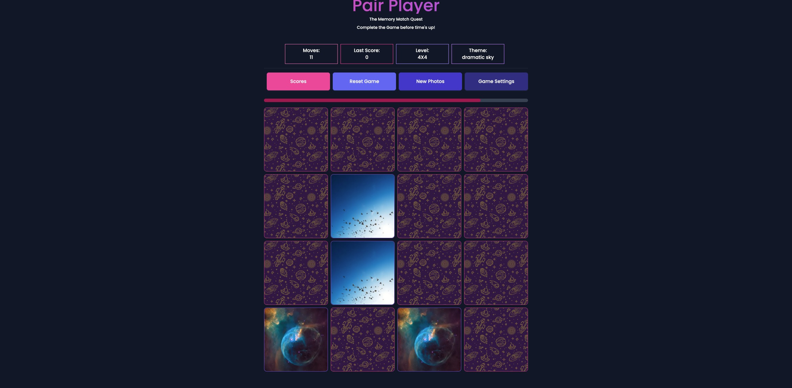

# Pair Player: The Memory Match Quest

Welcome to the Match Card Game! This is a React Next.js application with Tailwind CSS for styling. The game has been enhanced with additional features and now incorporates an API call to Unsplash for dynamic photo changes, offers multiple difficulty levels, and utilizes Redux for state management.

## Overview

The Match Card Game is a classic memory game where players need to match pairs of cards by flipping them over two at a time.

## Features

- Interactive card flipping.
- Responsive design with Tailwind CSS.
- Dynamic photo changes from Unsplash.
- Multiple difficulty levels.
- State management with Redux.

## Technologies Used

- React
- Next.js
- TypeScript
- Tailwind CSS
- Redux
- Unsplash API

## Getting Started

Follow these steps to run the project locally:

1. Clone the repository:
   `git clone https://github.com/bita/match-card-game.git`

2. Navigate to the project directory:
   `cd card-game`

3. Install dependencies:
   `npm install`
4. Start the development server:
   `npm run dev`

The game should now be accessible at http://localhost:3000.

## Usage

To play the game, click on cards to flip them over. Try to match pairs of identical cards by remembering their positions. The game ends when all pairs are matched.

## Testing

The Match Card Game includes end-to-end (E2E) tests using Cypress to ensure the functionality of the game. You can run these tests locally with the following steps:

1. Make sure the development server is running:
   `npm run dev`

2. Open a new terminal window and navigate to the project directory:
   `cd card-game`

3. Run the Cypress E2E tests:
   `npx cypress open`

This will open the Cypress Test Runner, where you can select and run the E2E tests.

## Roadmap

I have plans to enhance the game in the following ways:

Adding sound effects.
Timer for completing the game.
Allowing customization of card sets.

Author

Bita Jalili
Email: bita.djalili@gmail.com
